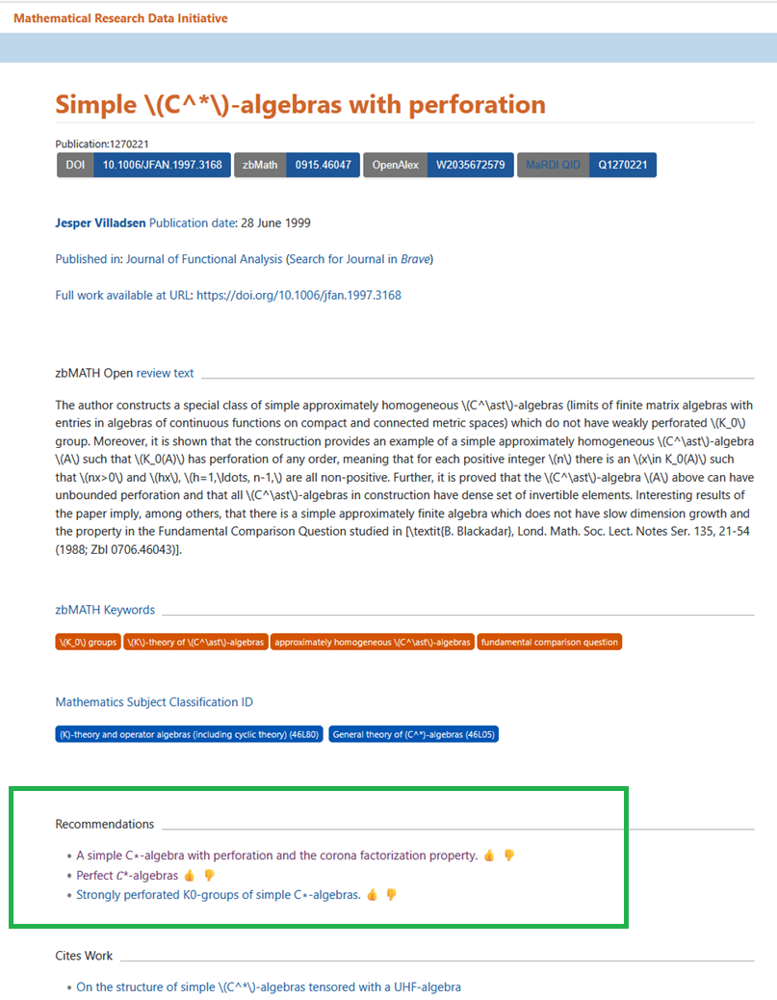

## Browsing MathExRec Recommendations on the MaRDI Portal

Here, we explain how to browse recommendations for **zbMATH Open** documents on the **MaRDI portal**.

### Steps to Access Recommendations

#### **Step 1: Identify the zbMATH Open Document**
When viewing a document on zbMATH Open, obtain its internal identifier (docID). Steps to obtain the docID for any zbMATH Open document: 
- [Link to an example document on zbMATH Open](https://zbmath.org/0915.46047)
- Click on the Cite button below the article.
- Select Format from the dropdown menu as "BibTeX"
- In the "BibTeX" key, the last digits after the word zbMATH0, i.e., 1213980 is the docID

#### **Step 2: Visit the MaRDI Portal**
Click on the following URL by replacing docID with the actual docID to access the document on the MaRDI portal: 

```https://portal.mardi4nfdi.de/wiki/Special:PidRedirect?propertyId=1451&value=<docID>```

- Example document with docID = 1213980
🔗 [https://portal.mardi4nfdi.de/wiki/Special:PidRedirect?propertyId=1451&value=1213980](https://portal.mardi4nfdi.de/wiki/Special:PidRedirect?propertyId=1451&value=1213980)

#### **Step 3: Access Recommendations**
- Scroll down to the **"Recommendations"** section.

### Example: Recommendations Preview  
Below is an example of recommendations displayed on the MaRDI portal:



Please note that we typically show 10 recommendations for each document. However, in the case of some documents, there may be fewer than 10 recommendations due to the unavailability of certain articles on the MaRDI platform.  

#### **Step 4: Feedback on Quality of Recommendations**

After each recommendation, you'll find a like or dislike icon next to the recommendation title. Simply click on the icon that best reflects your opinion of the recommendation (like if you find it helpful, or dislike if it's not relevant).
Once your feedback is successfully recorded, a confirmation message will appear. This feedback will then be used to improve generated recommendations.