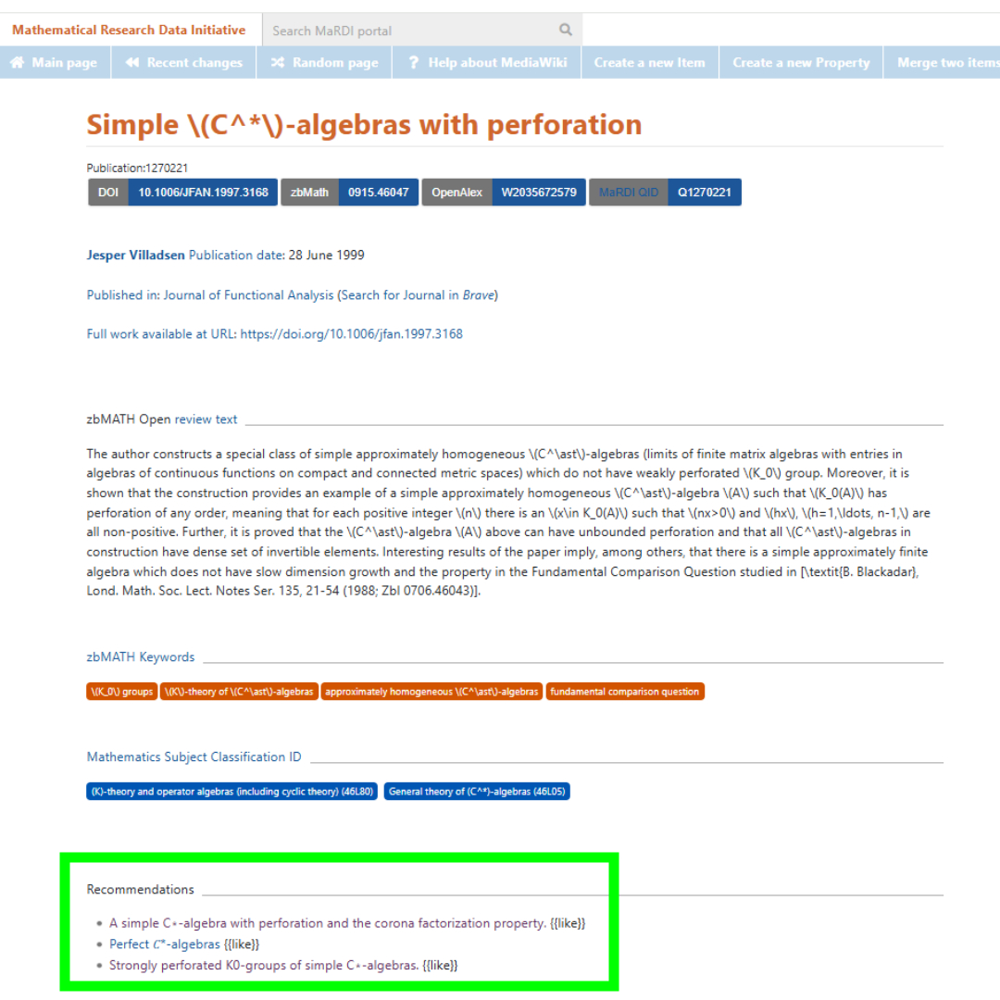

## MathExRec recommendations on Mardi portal

Here we explain how to browse recommendations on MaRDI portal.

Step 1: Visit MaRDI portal

Step 2: ENter zbMATHDOcumentID or search for any research paper for mathematics. The papers form zbMATHOPen will have recommendtaions. Please note that some documents might have not have recommendtaions if they are fairly new, have no mateadata except id, etc. Lets say we enter in search portal: Simple C*-algebras with perforation 

Step 3: Select the closest matching article

Step 4: Recommendations are available under the heading "Recommendations"

Sample recommendations on portal are shown in the image.

