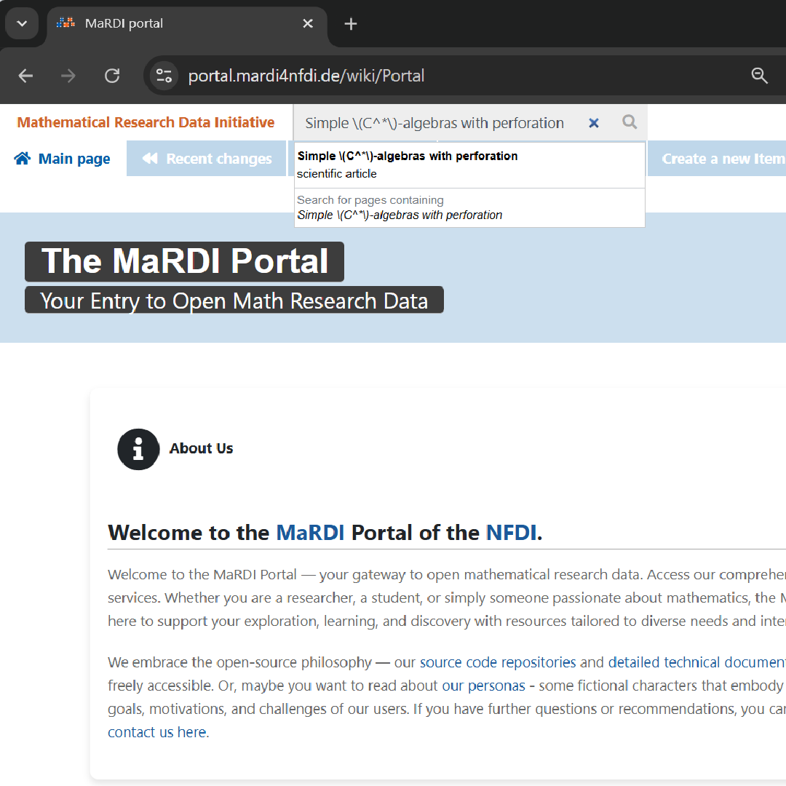

## Browsing MathExRec Recommendations on the MaRDI Portal

Here, we explain how to browse recommendations for **zbMATH Open** documents on the **MaRDI portal**.

### Steps to Access Recommendations

#### **Step 1: Identify the zbMATH Open Document**
When viewing a document on zbMATH Open, copy its title. 
- [An example document on zbMATH Open](https://zbmath.org/0915.46047)
- Title: *Simple \(C^*\)-algebras with perforation*
- Copy the math in LaTeX format. Ensure you copy the document title **exactly**, including LaTeX formatting, to view the document.

#### **Step 2: Visit the MaRDI Portal**
Click on the following URL to access the MaRDI portal search page:  
🔗 [MaRDI Portal](https://portal.mardi4nfdi.de/wiki/Portal)

#### **Step 3: Search for the Document**
Paste the title of the **zbMATH Open** document into the search bar, and **do not** click on the search icon.

#### **Step 4: Select the Closest Match**
- The search bar suggestions will display the closest matching results in the dropdown.
- **Do not** click the search icon; select the most relevant entry directly from the suggestions.
- If, after pasting a document title in the search bar, it shows no suggestions, the document might not exist on the MaRDI portal.

#### **Step 5: Access Recommendations**
- Click on the closest matching element.
- Scroll down to the **"Recommendations"** section.

### Example: Recommendations Preview  
Below is an example of recommendations displayed on the MaRDI portal:

---

### Critical Notes
- Ensure you copy the document title **exactly**, including LaTeX formatting if applicable.
- If, after pasting a document title in the search bar, it shows no suggestions, the document might not exist on the MaRDI portal.